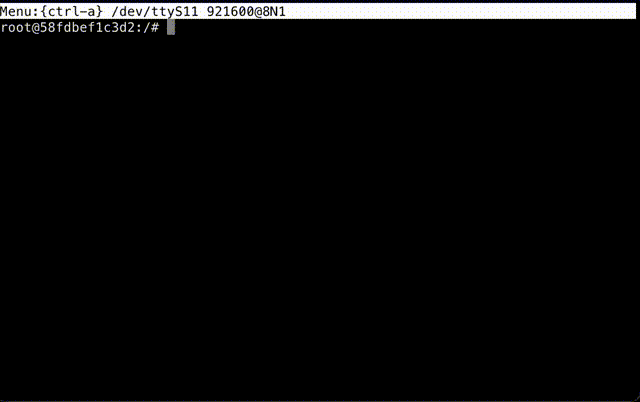

# Commy, a serial monitor

Commy is a small console utility for communicating with tty, UART or COM port devices. It runs on Mac, Linux and Windows. Windows support is experimental (bug reports appreciated).

Does (some of) the same things as [tio](https://github.com/tio/tio), [minicom](https://en.wikipedia.org/wiki/Minicom), [screen](https://www.gnu.org/software/screen/), [miniterm.py](https://github.com/pyserial/pyserial/blob/master/serial/tools/miniterm.py), [zcom](https://github.com/ZigEmbeddedGroup/zcom), [PuTTY](https://www.putty.org/), etc.

Commy incorporates a VT220/xterm/ECMA-48 terminal emulator for consistency whether running in [Windows Terminal](https://github.com/microsoft/terminal), [XTerm](https://en.wikipedia.org/wiki/Xterm) or [Terminal.app](https://en.wikipedia.org/wiki/Terminal_(macOS)).




# Build from source

```shell
zig build
zig-out/bin/commy -h
```

The binary is:

```shell
zig-out/bin/commy
```

Copy it to a directory in your path for easy access:

```shell
sudo cp zig-out/bin/commy /usr/local/bin
```

Or if you prefer, let zig install it in your home directory (assuming `~/.local/bin` is in your `$PATH`):

```shell
zig build -Doptimize=ReleaseSafe --prefix ~/.local
```

`commy` is a single statically linked binary. No further runtime files are required.
You may install it on another system by simply copying the binary. It can be cross compiled using zig's `-Dtarget`

```shell
zig build -Dtarget=x86_64-windows
```

# Typical use

List available serial ports

```shell
commy -l

/dev/cu.usbmodem1124101
/dev/cu.usbmodem1124203
```

Connect to a port

```shell
commy /dev/cu.usbmodem1124203 115200
```

Commy will try to find available ports which match so connecting to `/dev/ttyUSB0` can be written as:

```shell
commy USB0 115200
```

The status bar at the top shows keyboard shortcuts. Press `ctrl-a` then `q`, `\` or `x` to quit.

Log data received from a device (only received data will be logged, unless local echo is enabled):

```shell
commy /dev/cu.usbmodem1124203 115200 -o log.txt
```

Enable local echo of sent data, used for devices which do not echo back characters they receive:

```shell
commy /dev/cu.usbmodem1124203 115200 -e
```

# Why use Commy?

It tells you how to quit.

Commy does what I use GNU `screen` for, but it's better in two important respects. [First, it is slightly smaller; and secondly it has the words "ctrl-a and quit" inscribed in large friendly letters on its cover.](https://en.wikipedia.org/wiki/Towel_Day)

# Help text

    Usage: commy [ARGS] [OPTIONS]

    Args:
        port                                          serial port file
        speed                                         baudrate

    Options:
        -v, --version                                 Version
        -l, --list                                    List available serial ports
        -e, --echo                                    Enable local echo
        -o, --output=<output>                         Log to file
        -p, --parity=<parity>                         Parity
                                                        values: { none, even, odd, mark, space }
        -w, --wordsize=<wordsize>                     wordsize
                                                        values: { five, six, seven, eight }
        -s, --stop=<stop>                             stop
                                                        values: { one, two }
        -f, --flow=<flow>                             flow
                                                        values: { none, software, hardware }
        -h, --help                                    Print this help and exit

# Testing

If no serial device is available, commy can connect to a Linux serial terminal inside docker. From here, any standard linux terminal software can be used.

```shell
cd linux-test
./lincommy.sh
```

This will build commy, then build a docker container and start it. Inside the container `socat` will create a virtual serial port and bind it to `bash`. commy will then connect to the virtual serial port. Quitting commy will close down the docker container.

